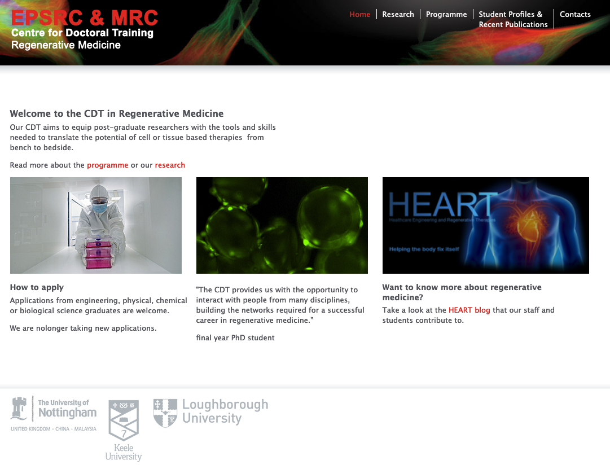

```{r setup, include=FALSE}
knitr::opts_chunk$set(echo = FALSE, message = FALSE,
                      fig.showtext = TRUE, fig.retina = 3, warning = FALSE)
options(knitr.kable.NA = '') # sets NAs in tables to be blank
options(knitr.table.format = "html")
library(tidyverse)
library(kableExtra)
library(leaflet)
library(DT)
library(DiagrammeR)
```

```{r, label='dri-hexcolours', include=FALSE}
dri_hexcolours <- c("dark_blue" = "#00326e", "light_grey" = "#c4d1d9",
                    "dark_grey" = "#415767", "sky_blue" = "#0ac8ff",
                    "petrol_blue" = "007faf", "brigth_blue" = "4682ff",
                    "cobalt" = "325ad7", "violet" = "#461e8c", "fuchsia" = "#fa2d6e",
                    "ruby" = "#aa0050", "yellow" = "#ffed00")
```

```{r, load_refs, include=FALSE, cache=FALSE}
## load package
library(RefManageR)
## set citation styles
RefManageR::BibOptions(check.entries = FALSE,
           bib.style = "authoryear",
           cite.style = "authoryear",
           style = "markdown",
           hyperlink = "to.doc",
           dashed = FALSE)
## read bib file
bib <- RefManageR::ReadBib("references/example.bib", check = FALSE)
```

name: title-slide
class: title-slide

# Introductions
## & where I'm at

### <span style="color:white;">Gabriel Mateus Bernardo Harrington</span>
### Research Associate<br>Rebecca Sims group
### 2022-05-03 (updated: `r Sys.Date()`)

---

# Background

.pull-left[

```{r, label='ideal-biomarker-schematic', out.width="100%"}
mermaid("
graph TD
    F-->A2
    subgraph Pre-PhD 2016-18
        A[BSc: Biological Sciences<br>- Lancaster University] -->|existential angst| B(Optogenetics in Cochlea implants<br>- Bionics institute, Melbourne)
    end
    subgraph Mini-project rotations 2018-19
        B --> C(Center for Doctoral Training<br>- Regen medicine)
        C -->|One| D[Gene expression in adherent<br>and non-adherent hydrogels<br>- Loughborough University]
        C -->|Two| E[Effects of AC on interfacing wires<br>grown via wireless electrochemisty<br>- Nottingham University]
        C -->|Three| F[Viability of 'lung on a chip' model<br>- Keele University]
    end
    subgraph PhD 2019-2022
        A2[PhD: A multimodal approach to biomarker<br>discovery for spinal cord injury]-->B2[Here!]
    end
")
```

]

.pull-right[

```{r, label='life-history-imgs', out.width='50%'}


```

]

---

# Cohort database

.pull-left[

- Series of cohorts Cardiff has been involved in recruiting
- Rich phenotypic data
  - Problem: data not in a structure very amenable to analysis
  - Solution: create relational database to house data in a structure and well controllable manner
    - Used the free and open-source [PostgreSQL](https://www.postgresql.org/)
- General recommendations:
  - Spreadsheets are rubbish
  - Consider using relational databases for anything you actually care about, especially longer term projects and/or ones with lots of people inputting data

]

.pull-right[

```{r, label='postgres', out.width='60%'}
knitr::include_graphics("images/postgresql.jpg")
#knitr::include_graphics("images/excel_hell.png")
knitr::include_graphics("https://media.giphy.com/media/Sb9KqeeymLlESGWZyE/giphy.gif")
```

]

---

# Whole exsome sequence data

.pull-left[

- Inherited from Didi, she had done a lot of the initial file processing
- Currently grappling with VCF file annotation via [Hail](https://hail.is/)
- Sample IDs also not matching phenotype data very well, see previous point regarding spreadsheets being rubbish
  - Building a lookup table, pending the remaining data coming from the field team
- Data soon&trade; (I hope)

]
.pull-right[

```{r, label='wes-img', out.width='80%'}
knitr::include_graphics("https://media.giphy.com/media/lkdH8FmImcGoylv3t3/giphy.gif")
```

]

---

# Reproducible slides

.pull-left[
- I made a little R package with a template for making slideshows with the DRI theme via RMarkdown/[xaringan](https://github.com/yihui/xaringan)
- Nice ability to easily host slides online, see some of my presentations [here](https://h-mateus.github.io/presentations/)
- Package can be found in this GitHub repo: [H-Mateus/dri.xaringan.theme](https://github.com/H-Mateus/dri.xaringan.theme)
- An example presentation using the DRI (in addition to what you're looking at) can be found [here](https://h-mateus.github.io/presentations/example_dri_theme/index.html#1)
]

.pull-right[
```{r, label='excel-sucks', out.width='70%'}
knitr::include_graphics("https://media.giphy.com/media/lTRuG1F4VZ3LHMpXY2/giphy.gif")
```
]

---

class: final-slide

# Thanks for listening

<br>
.left[
<div style="color:skyblue;">
<span style="color:white;"><b>Gabriel Mateus Bernardo Harrington</b></span><br>
<b>Research Assocaite</b><br>
<b></b>
</div>

]

These slides can be found from the QR code below, or at this address:<br>[https://h-mateus.github.io/presentations/gregynog_2022-04-28/index.html#1](https://h-mateus.github.io/presentations/gregynog_2022-04-28/index.html#1)

```{r, make-qr-code, eval=FALSE}
library(qrcode)
png("images/slide_qr.png")
qrcode_gen('https://h-mateus.github.io/presentations/gregynog_2022-04-28/index.html#1')
dev.off()
```

.pull-left[
```{r, label='slide-qr', out.width='50%'}

```
]
