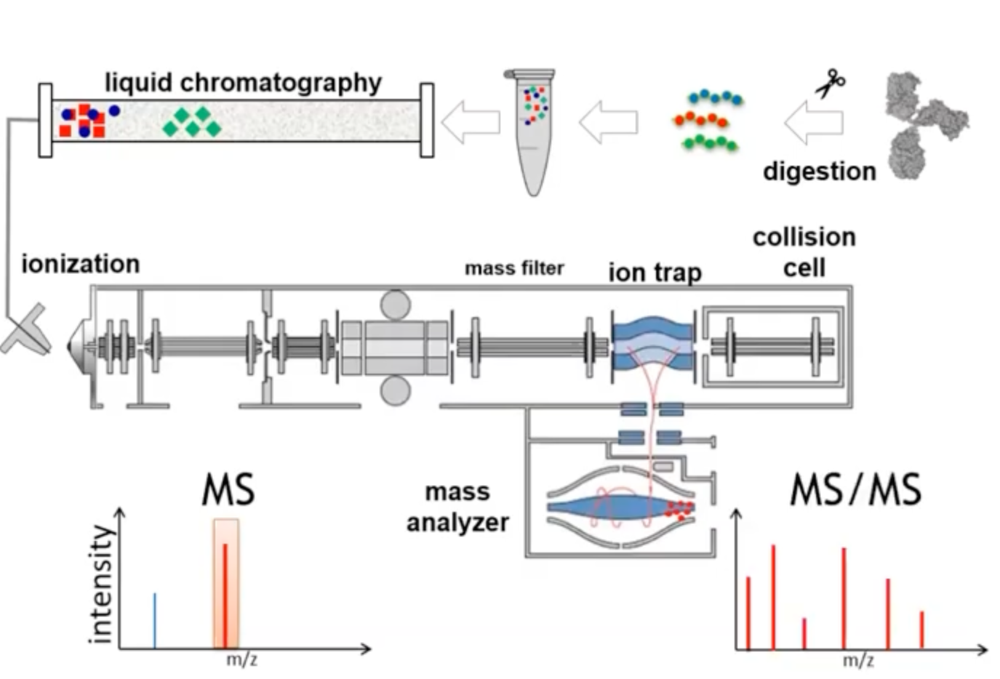
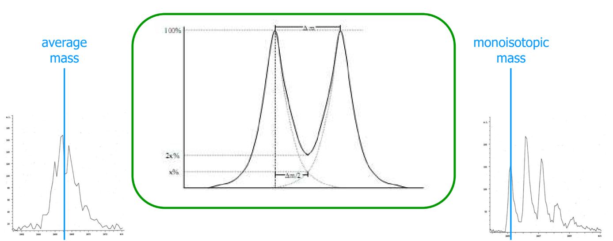
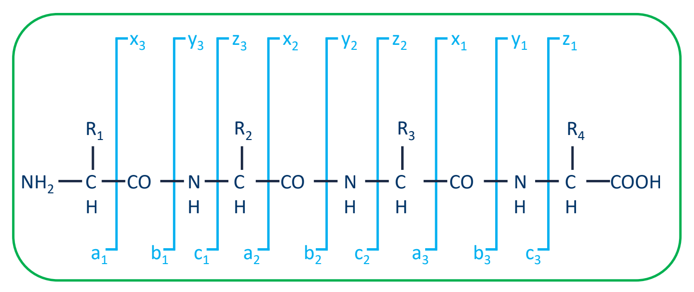
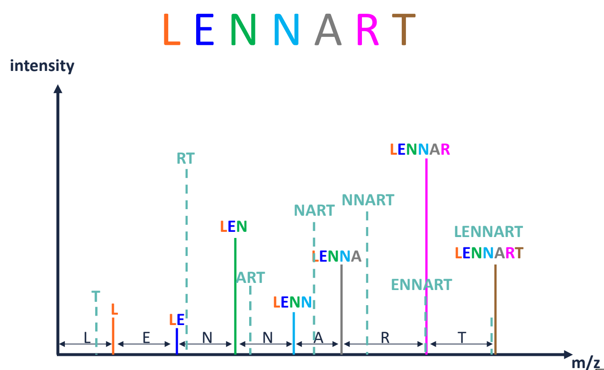
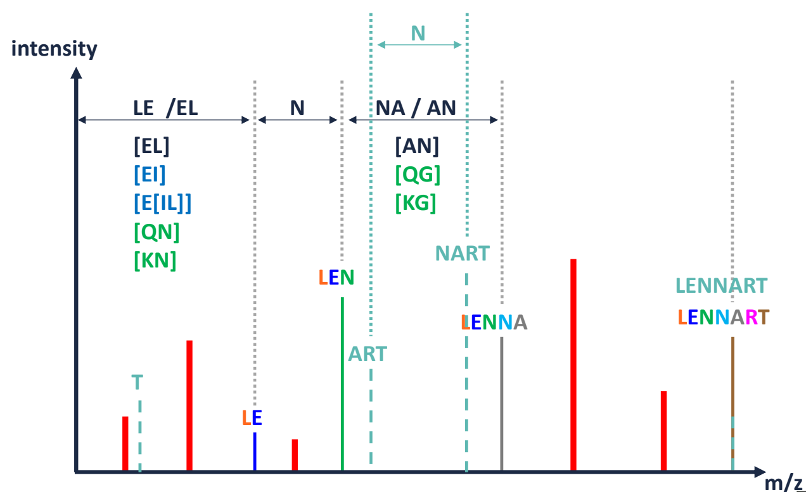
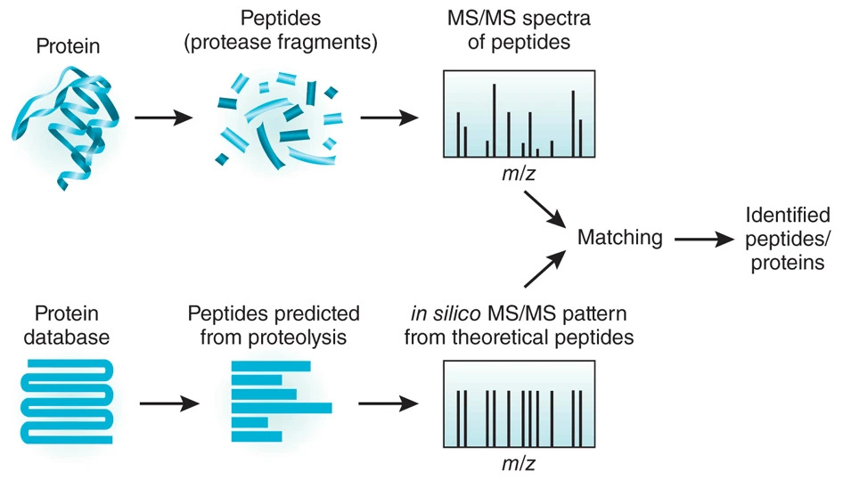
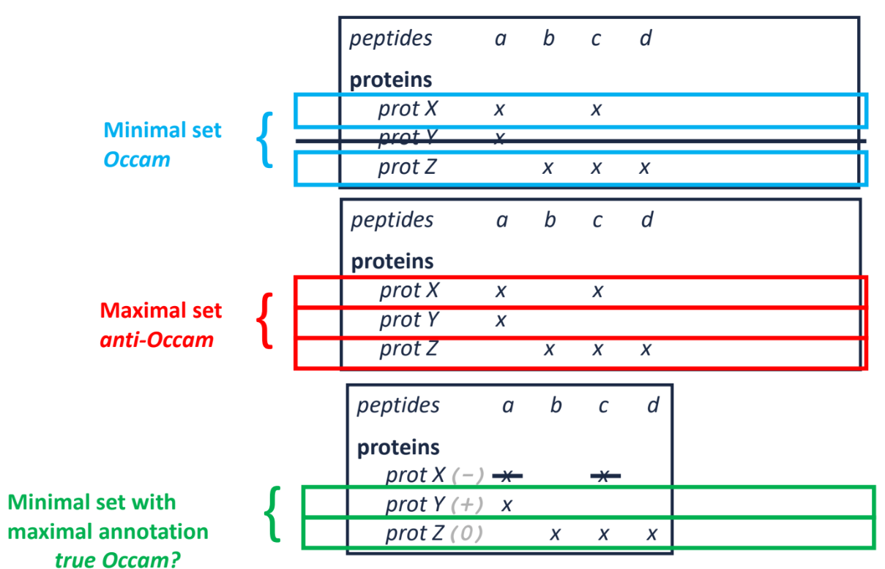
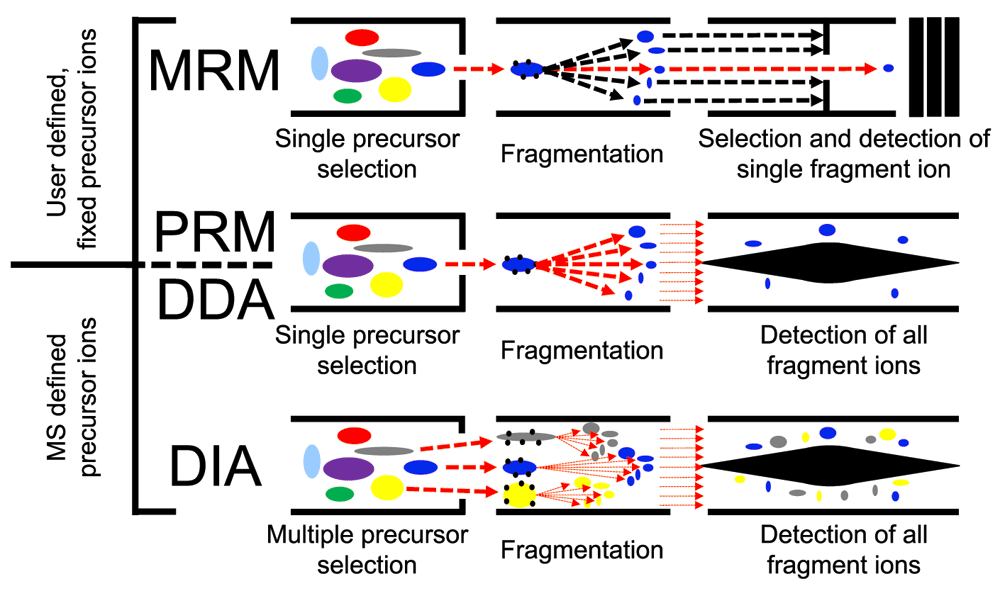

```{r setup, include=FALSE}
knitr::opts_chunk$set(echo = FALSE, message = FALSE,
                      fig.showtext = TRUE, fig.retina = 3, warning = FALSE)
options(knitr.kable.NA = '') #sets NAs in tables to be blank
options(knitr.table.format = "html") #set correct kable format
library(tidyverse)
library(kableExtra)
```


```{r, load_refs, include=FALSE, cache=FALSE}
## load package
library(RefManageR)
## set citation styles
BibOptions(check.entries = FALSE,
           bib.style = "authoryear",
           cite.style = "authoryear",
           style = "markdown",
           hyperlink = "to.doc",
           dashed = FALSE)
## read bib file. trying to read masterlib causes R to crash, maybe file size or non-standard characters
bib <- ReadBib("ipmar_proteomics.bib", check = FALSE)
```

```{r, label='dri-hexcolours', include=FALSE}
dri_hexcolours <- c("dark_blue" = "#00326e", "light_grey" = "#c4d1d9",
                    "dark_grey" = "#415767", "sky_blue" = "#0ac8ff",
                    "petrol_blue" = "007faf", "brigth_blue" = "4682ff",
                    "cobalt" = "325ad7", "violet" = "#461e8c", "fuchsia" = "#fa2d6e",
                    "ruby" = "#aa0050", "yellow" = "#ffed00")
```

name: title-slide
class: title-slide

# Proteomics
## A brief overview

### <span style="color:white;">Gabriel Mateus Bernardo Harrington</span>
### Research Associate<br>Sims Group
### 2022-06-22 (updated: `r Sys.Date()`)

<!--Use the following to add further logos to the title/final slide-->
<!--Adjust sizing in the CSS file-->

<div class="title-logo-1"></div>
<div class="title-logo-2"></div>

---

# Two high-level approaches

### Top-down proteomics

- Uses intact whole proteins
- Limited to only a investigating a small number of predefined proteins
- Good for looking at protein modifications (e.g. phosphorylations)

### Bottom-up proteomics

- Proteins are digested into peptides
- Can be used to examination of protein subsets, but also for characterising the whole proteome

Basic steps:
 1. Enzymatically digest proteins into peptides
 1. Sort the peptides using high-performance liquid chromatography
 1. Feed this into a mass spectrometer which fragments the peptides further and measures the mass/charge of the resulting fragments

---

.center[
```{r, label='bottom-up-proteomics', out.width='80%'}

```
]

???

- we're using [S-TRAP](https://protifi.com/pages/s-trap) kit from a company called Protifi to prep the samples
- It's a system for binding the proteins, allowing you to clean any contaminates, denature the proteins and digest them to peptides
- trypsin cuts at lysine and arginine


---

# Mass resolution matters

- Resolution is mass spectrometry relates to the width of a peak at a given hight (typically 50% peak height) .footnote[Image taken from: `r AutoCite(bib, c("eidhammer_computational_2007"))`]


.center[
```{r, label='monoisotopic-peak', out.width='90%'}

```
]

???

- use of isotopes to figure out charge - carbon 13, if next peak is +1m/z, then ion is plus one, if it's plus +2 then it'd be +0.5m/z
- this can cause problems at larger masses as it becomes less likely there is a peak with no carbon 13

---

# Fragmentation ladders

- Bonds are weaker between amino acids as opposed to within them, therefore the $b_i$ and $y_i$ fragments are of most interest

.center[
```{r, label='fragmentation-ladder', out.width='90%'}

```
]

---

# Interpretable ion ladder

- Ideally, this is the sort of ladder we'd get... .footnote[Image taken from Lennart Martens presentation]

.center[
```{r, label='ideal-ion-ladder', out.width='65%'}

```
]

---

# Interpretable ion ladder

- Realistically, this is the sort of ladder we get... .footnote[Image taken from Lennart Martens presentation]

.center[
```{r, label='realistic-ion-ladder', out.width='65%'}

```
]

???

- we get a range of potential sequences with different scores

---

# Peptide identification

- ***De Novo* search**: sequence a peptide by building a graph of observed amino acid distances in a spectrum. Then find a path that explains the peptide mass and e.g., most of the observed peaks
- **Spectral library matching**: compare against previously observed or predicted spectra
- **Database search**: Generate theoretical spectra and compare against observed ones .footnote[Image taken from: `r AutoCite(bib, c("duncan_pros_2010"))`]

.center[
```{r, label='database-search', out.width='65%'}

```
]

???

- you get multiple PSM scores for different matches returned, not just the best score
- intensities aren't typically computed in the *in-silico* spectra, but there are modern methods that attempt this
- there are also methods that try to predict retention time

---

# False discovery rates

- Problem: there's uncertainty in matches, we need a means to quantify and correct for inaccurate matches
- Solution: Create decoy sequences to match against to compute the ratio of false targets

$$FDR = \frac{\#decoys}{\#targets}$$

- Reversing sequences in database is a common way to make the decoys

FDR from posterior error probabilities (PEP):
- e.g. [PeptideProphet](http://proteinprophet.sourceforge.net/)
- fit a mixture model (true hit / false hit) to score distributions

Post-processing:
- e.g. [Percolator](http://percolator.ms/): machine learning to discriminate between correct and incorrect PSMs
- can improve results is score of individual spectra are not easily comparable (not well calibrated)

---

# Protein identification

.center[
```{r, label='protein-identification', out.width='65%'}

```
]

.pull-right[Image taken from: `r AutoCite(bib, c("martens_proteomics_2007"))`]

---

# Data acquisition techniques

- Parallel Reaction Monitoring (PRM): good for quantitation of pre-selected protein/s (succeeded MRM)
- Data Dependent Acquisition (DDA): good for comprehensive detection of whole proteome
- **Data Independent Acquisition (DIA): hybrid that aims to do both**

.center[
```{r, label='data-acquisition-techniques', out.width='65%'}

```
]

---

class: final-slide

# Thanks for listening

<br>
.left[
<div style="color:skyblue;">
<span style="color:white;"><b>Gabriel Mateus Bernardo Harrington</b></span><br>
<b>Research Assocaite</b><br>
<b></b>
</div>

]

These slides can be found from the QR code below, or at this address:<br>[https://h-mateus.github.io/presentations/ipmar_proteomics_2022-06-01/index.html#1](https://h-mateus.github.io/presentations/ipmar_proteomics_2022-06-01/index.html#1)

```{r, make-qr-code, eval=FALSE}
library(qrcode)
png("images/slide_qr.png")
x <- qr_code('https://h-mateus.github.io/presentations/ipmar_proteomics_2022-06-01/index.html#1')
plot(x)
dev.off()
```

.pull-left[
```{r, label='slide-qr', out.width='50%'}

```
]

---

## References

```{r, label='print-bib', results="asis"}
PrintBibliography(bib, start = 1, end = 7)
```

