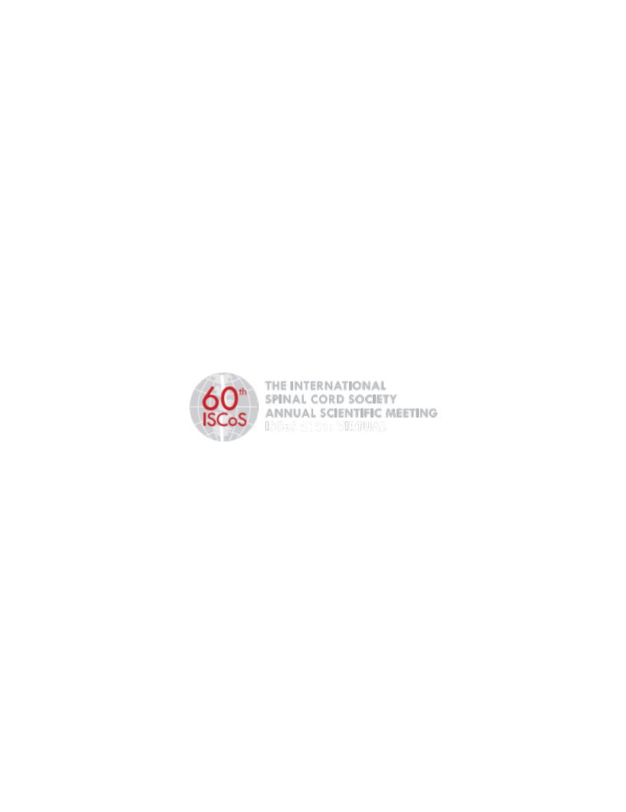

```{r setup, include=FALSE}
knitr::opts_chunk$set(echo = FALSE, message = FALSE,
                      fig.showtext = TRUE, fig.retina = 3, warning = FALSE)
options(knitr.kable.NA = '') #sets NAs in tables to be blank
library(xaringanthemer)
library(tidyverse)
library(kableExtra)
```

```{r xaringan-themer, include=FALSE}
## set theme details via xaringanthemer - this generates the xaringan-themer.css file
style_duo(primary_color = "#1F4257", secondary_color = "#F97B64",
          ## lower header font sizes by 0.5rem
          header_h1_font_size = "2.25rem", header_h2_font_size = "1.75rem",
          header_h3_font_size = "1.25rem",
          ## set srtiped row colour for tables
          table_row_even_background_color = "#F97B64")
```


## Speaker declaration

I declare to have no interests in the below:

- The existence of any significant financial activity or other relationship
- Financial or material compensation in relation to research and publishing
- Financial or material compensation in relation to educational activities
- Ownerships and possessions in companies related to health care (includes service provides, IT)
- Compensation for expert functions in health care and consulting health care guidance processes

???

- What an odd compulsory speil...

---

## "Bottom-up" Proteomics - A brief overview

1. Extract consistent total protein concentration for each sample
1. Optional dimensionality reduction steps (e.g. via Proteominer&trade; beads)
1. Digest proteins (Trypsin is commonly used)
1. For labelled techniques, the labels are applied
1. Samples are fed through some flavour of chromatography and into the mass spec (e.g. high-performance liquid chromatography)

--

### Techniques used:

- Isobaric tag for relative and absolute quantitation ([iTRAQ](https://en.wikipedia.org/wiki/Isobaric_tag_for_relative_and_absolute_quantitation)) and [label-free](https://en.wikipedia.org/wiki/Label-free_quantification) proteomic experiments were conducted

.center[
```{r, label='itraq-tag', out.width="40%"}
knitr::include_graphics("../proteomic_talk_2020-09-24/itraq_labels.png")
```
]

???

- Highlight complexity and uncertainty in measurements - put data in context, further work needed etc.

---

## Experimental design

- Samples are plasma from SCI human patients
- Two time points:
  1. "Acute": ~2-weeks post-injury
  1. "Subacute": ~3-months post-injury
- Improvers are AIS C patients who experienced an AIS grade conversion

```{r, label='sample-counts'}
sample_counts <- read_csv("sample_counts_2021-04-30.csv")
kbl(sample_counts) %>%
    kable_styling(bootstrap_options = c("hover"))
```

---

## iTRAQ proteins of interest

.pull-left[
```{r, label='itraq-plots', fig.retina=3}
## make list of bar graphs for each group
## load data
load(file = "../../mateus/proteomics/data/protein_descriptions_long.rda")
## vector of proteins to filter to
proteins <- c("A2M -|APOE -|RBP4 -|SAA1 -")
## filter df
df_filt <- protein_descriptions %>%
    dplyr::filter(grepl(proteins, protein_name)) %>%
    dplyr::mutate(prot = gsub( " .*$", "", protein_name),
        prot_full_name = strsplit(protein_name, " - ")[[1]][2])
## update group labels
df_filt$group_labels <- as.factor(df_filt$group_labels)
new_labs <- c("Acute A VS Acute D",
              "Acute VS Subacute C improvers",
              "Acute C improvers VS non-improvers",
              "Acute C improvers VS Subacute non-improvers",
              "Subacute C improvers VS Acute C non-improvers",
              "Subacute C improvers VS non-improvers",
              "Acute Vs Subacute C non-improvers",
              "Acute C improvers VS non-improvers (2)",
              "Acute C improvers VS Acute A",
              "Acute C improvers VS Acute D",
              "Acute C non-improvers VS Acute A",
              "Acute C non-improvers VS Acute D")
levels(df_filt$group_labels) <- new_labs
## plot
df_filt %>%
    dplyr::filter(prot == "A2M") %>%
    ggplot(aes(x = reorder(group_labels, -fold_change), y = fold_change, fill = group_labels)) +
    geom_bar(stat="identity", position = position_dodge()) +
    facet_wrap( ~ prot) +
    labs(x = "", y = expression(log[2] ~ fold - change)) +
    theme(legend.position = "none", axis.text = element_text(size = 12)) +
    scale_x_discrete(labels = function(x) str_wrap(str_replace_all(x, "foo" , " "),
                                                   width = 18)) +
    coord_flip() +
    theme_xaringan() +
    scale_xaringan_fill_discrete()
```
]

.pull-right[
- [Alpha-2-macroglobulin](https://www.uniprot.org/uniprot/P01023)
  - Protease inhibitor
]

---

- [Alpha-2-macroglobulin](https://www.uniprot.org/uniprot/P01023)
  - Less abundant in acute AIS C improvers relative to non-improvers
  - Protease inhibitor
- Several apolipoproteins, ApoE in particular
- [Serum amyloid A1](https://www.uniprot.org/uniprot/P0DJI8)
- [Retinol-binding protein 4](https://www.uniprot.org/uniprot/P02753)

class: center, middle


---

.pull-left[


<br/>


]
.pull-right[


]

---

### And it makes you more employable!

.center[]

.center[You: "Sounds great! Is there anything else I can do to make my research more reproducible?"]

.center[Me: "**I'm glad you asked**"]

.center[You: "I was being sarcastic you stupid pri-"]

---

## What is "version control", and why should you care?

--

.left-column[]

- System that records changes to a file or set of files over time

--

- Nerds returned and made various flavours of **Distributed Version Control Systems** of which **Git** is the most popular

---

## So what does Git do?

- Automatically tracks any changes within a local "repository" (AKA a git repo)
  - A repo is just a folder with a repo initialised in it

- A service like [GitHub](https://github.com/), [GitLab](https://about.gitlab.com/) or [Bitbucket](https://bitbucket.org/product) can then be used to upload your local repository
  - It doesn't matter which you use, the basic functionality is the same

--

- Any changes the collaborate makes can then be re-synced to the shared repo
  - Git allows you to see who has made what changes to each file
  - Git also requires you to make a comment when you perform a commit, giving a summary of what each change did

.pull-left[

]
.pull-right[
```{r, out.width="80%", echo=FALSE}
knitr::include_graphics("https://cdn-images-1.medium.com/max/1600/1*j9hbjszo0zXS32yhvSkdAQ.jpeg")
```

]

---

## Licensing considerations

.pull-left[
- You don't need to be a lawyer, but you should be aware of some common licenses to watch out for

- Stick to using free and open-source software as much as possible
  - Work that relies on paid licenses **isn't** reproducible!
]

.pull-right[
```{r, out.width="80%", echo=FALSE}
knitr::include_graphics("https://altc.alt.ac.uk/oesig/wp-content/uploads/sites/1119/2016/07/creative-commons-783531_1280.png")
```
]

- Also worth thinking about licensing your work

- [Creative commons licences](https://creativecommons.org/licenses/) are generally very permissive, but there are multiple version to match different concerns:
  - Attribution (give me credit)
  - ShareAlike (new creations must share license terms)
  - NoDerivs (no sharing in adapted form)
  - NonCommercial (self-explanatory...)

- Alternatives: [GPL](https://www.gnu.org/licenses/gpl-3.0.en.html), [MIT](https://www.mit.edu/~amini/LICENSE.md), etc.

---

## Containerisation: bringing it all together

- So what if someone actually wants to download your data, script/s and writing and try to reproduce them?

.pull-left[
- They may run into the fun of [dependency hell](https://www.browserlondon.com/blog/2020/09/02/dependency-hell-how-to-avoid-it/)
  - They may have different versions of software, or be missing a dependency that's no longer available

- Solution: Containerisation
  - "A standardised unit of software"
  - Packages up code and dependencies to run consistently in different computing environments
  - [Docker](https://www.docker.com/resources/what-container) is a popular approach
]

.pull-right[
```{r, out.width="100%", echo=FALSE}
knitr::include_graphics("https://assets.browserlondon.com/app/uploads/2020/08/XKCD-dependency.png")
```
]


---

#### Links to this slide deck:

The rendered slides can be found at this address:

- [https://h-mateus.github.io/presentations/reproducible_research_2021-04-30/index.html#1](https://h-mateus.github.io/presentations/reproducible_research_2021-04-30/index.html#1)

.center[

]

The raw files are on GitHub [here](https://github.com/H-Mateus/presentations) under the GPL license

#### Acknowledgements

.pull-left[
- Thanks to humans: Karina Wright, Paul Cool, Charlotte Hulme & the rest of the [OsKOR team](https://oskor.netlify.app/)
- Thanks for the money: [EPSRC](https://epsrc.ukri.org/)
]

.pull-right[
```{r, label='epscr', out.width='80%'}

```
]
