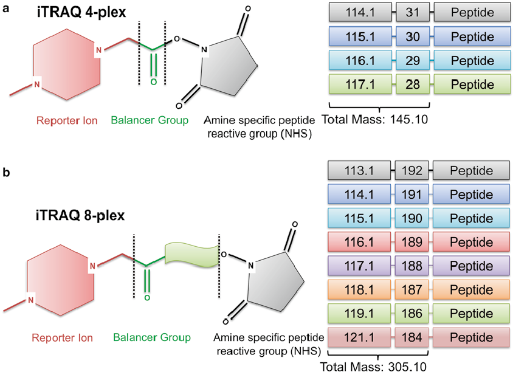
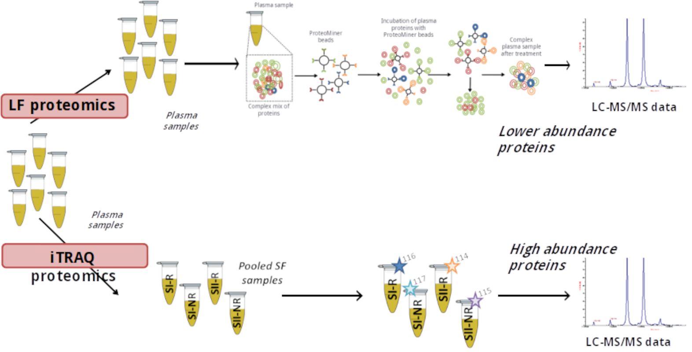

```{r setup, include=FALSE}
knitr::opts_chunk$set(echo = FALSE, message = FALSE,
                      fig.showtext = TRUE, fig.retina = 3, warning = FALSE)
options(knitr.kable.NA = '') #sets NAs in tables to be blank
library(xaringanthemer)
library(tidyverse)
library(kableExtra)
library(ggVennDiagram)
library(MSstats)
library(RefManageR)
library(leaflet)
```

```{r, load_refs, include=FALSE, cache=FALSE}
## set citation styles
BibOptions(check.entries = FALSE,
           bib.style = "authoryear",
           cite.style = "authoryear",
           style = "markdown",
           hyperlink = "to.doc",
           dashed = FALSE)
## read bib file. trying to read masterlib causes R to crash, maybe file size or non-standard charaters
bib <- ReadBib("iscos_talk_2021.bib", check = FALSE)
```

```{r xaringan-themer, include=FALSE}
## set theme details via xaringanthemer - this generates the xaringan-themer.css file
style_duo(primary_color = "#1F4257", secondary_color = "#F97B64",
          ## lower header font sizes by 0.5rem
          header_h1_font_size = "2.25rem", header_h2_font_size = "1.75rem",
          header_h3_font_size = "1.25rem",
          ## set srtiped row colour for tables
          table_row_even_background_color = "#F97B64")
```


## Speaker declaration

I declare to have no interests in the below:

- The existence of any significant financial activity or other relationship
- Financial or material compensation in relation to research and publishing
- Financial or material compensation in relation to educational activities
- Ownerships and possessions in companies related to health care (includes service provides, IT)
- Compensation for expert functions in health care and consulting health care guidance processes

.center[
```{r, label='oswestry-leaflet', fig.height=4, fig.width=10.5 }
leaflet() %>% addTiles() %>% setView(-3.033414, 52.884422, zoom = 16)
```
]

???

- What an odd compulsory speil...

---

## Prior work

```{r, label='data-prep'}
## openms data
foldchange_list <- readRDS("../../mateus/proteomics/data/openms/protein_quantification_foldchanges.rds")
## merge list of dfs
fc_openms <- do.call(rbind, foldchange_list)
## add run column
fc_openms <- fc_openms %>%
    rownames_to_column() %>%
    dplyr::mutate(run = case_when(
                      grepl("run1", rowname) ~ "1",
                      TRUE ~ "2")) %>%
    dplyr::mutate(group_labels = paste(comparison, run, sep = "_run"))
## sort group labels
fc_openms$group_labels <- as.factor(fc_openms$group_labels)
levels(fc_openms$group_labels) <- c("Acute AIS A vs D",
                                "Acute AIS C improvers vs A",
                                "Acute AIS C improvers vs non-improvers",
                                "Acute AIS C improvers vs non-improvers (2)",
                                "AIS C improvers acute vs subacute",
                                "Acute AIS C improvers vs D",
                                "Acute AIS C non-improvers vs A",
                                "AIS C non-improvers acute vs subacute",
                                "Acute AIS C non-improvers vs D", "CROSS-RUN",
                                "Subacute AIS C improvers vs non-improvers",
                                "CROSS-RUN2", "CROSS-RUN3", "CROSS-RUN4")
## vector of proteins to filter to
proteins <- c("A2M|APOE|RBP4|SAA1")
## filter df
df_filt_oms <- fc_openms %>%
    dplyr::filter(grepl(proteins, gene) & !grepl("CROSS", group_labels))

## proteinpilot data
load(file = "../../mateus/proteomics/data/protein_descriptions_long.rda")
## vector of proteins to filter to
proteins <- c("A2M -|APOE -|RBP4 -|SAA1 -")
## filter df
df_filt_pp <- protein_descriptions %>%
    dplyr::filter(grepl(proteins, protein_name)) %>%
    dplyr::mutate(gene = gsub( " .*$", "", protein_name),
        prot_full_name = strsplit(protein_name, " - ")[[1]][2])
## update group labels
df_filt_pp$group_labels <- as.factor(df_filt_pp$group_labels)
new_labs <- c("Acute A VS Acute D",
              "Acute VS Subacute C improvers",
              "Acute C improvers VS non-improvers",
              "Acute C improvers VS Subacute non-improvers",
              "Subacute C improvers VS Acute C non-improvers",
              "Subacute C improvers VS non-improvers",
              "Acute Vs Subacute C non-improvers",
              "Acute C improvers VS non-improvers (2)",
              "Acute C improvers VS Acute A",
              "Acute C improvers VS Acute D",
              "Acute C non-improvers VS Acute A",
              "Acute C non-improvers VS Acute D")
levels(df_filt_pp$group_labels) <- new_labs
df_filt_pp$log2_fold_change <- df_filt_pp$fold_change
## choose which dataset to use
df_filt <- df_filt_pp
## df_filt <- df_filt_oms

## get model data
df_models <- read_rds('heam_model_data.rds')
```

- Modelling of SCI neurological outcomes with routine haematological markers `r AutoCite(bib, c("brown_preliminary_2019", "bernardo_harrington_routinely_2020"))`
- Found markers associated with liver function added modest predictive value
- Implicates liver status/metabolic health with neurological outcomes

.center[
```{r rsquare-plot, out.width="50%"}
ggplot(df_models, aes(x = target_name, y = Rsquare, fill = modelName)) +
    geom_bar(stat="identity", position=position_dodge(), color = "black") +
    xlab("") +
    ylab(parse(text = "R^2")) +
    scale_y_continuous(limits = c(0,1)) +
    ## theme(axis.text.x = element_text(angle = 45, vjust = 0.5, hjust = 0.5)) +
    scale_x_discrete(labels = function(x) str_wrap(str_replace_all(x, "foo" , " "),
                                                   width = 20)) +
    coord_flip() +
    theme_xaringan() +
    scale_xaringan_fill_discrete(label = c("GLM", "LRM"), name = "Model") +
    theme(legend.position = "bottom", axis.text = element_text(size = 18, face="bold", colour = "white"))
```
]

---

## "Bottom-up" Proteomics - A brief overview

1. Extract consistent total protein concentration for each sample
1. Optional dimensionality reduction steps (e.g. via Proteominer&trade; beads)
1. Digest proteins (Trypsin is commonly used)
1. For labelled techniques, the labels are applied
1. Samples are fed through some flavour of chromatography and into the mass spec (e.g. high-performance liquid chromatography)

--

### Techniques used:

- Isobaric tag for relative and absolute quantitation ([iTRAQ](https://en.wikipedia.org/wiki/Isobaric_tag_for_relative_and_absolute_quantitation)) and [label-free](https://en.wikipedia.org/wiki/Label-free_quantification) proteomic experiments were conducted

.center[
```{r, label='itraq-tag', out.width="40%"}

```
]

???

- Highlight complexity and uncertainty in measurements - put data in context, further work needed etc.

---

## Dynamic range reduction via<br>Proteominer&trade; beads

- Abundant proteins saturate beads, whereas less abundant proteins don't
- Once the column is washed, the excess abundant proteins are removed, and the less abundant proteins are retained, thus the dynamic range is reduced

```{r, label='proteomic-diagram', fig.align="center"}

```

---

## Experimental design

- Plasma from SCI human patients
- Two time points:
  1. "Acute": ~2-weeks post-injury
  1. "Subacute": ~3-months post-injury<sup>*</sup>
- Improvers are AIS C patients who experienced an AIS grade conversion
- 2 4-plex iTRAQ runs and a more recent label-free experiment with all samples

```{r, label='sample-counts'}
sample_counts <- read_csv("sample_counts_2021-04-30.csv")
kbl(sample_counts) %>%
    kable_styling(bootstrap_options = c("hover"))
```

.footnote[<sup>*</sup> iTRAQ experiments did not include AIS A or D groups at the subacute time point]

---

## iTRAQ key pathway - Complement cascade

- Total number of proteins identified: `r length(unique(fc_openms$gene))`
- Majority of proteins identified are part of the complement cascade, differences in these pathways appears to be at least partially responsible for heterogeneous outcomes
- Many of these proteins interact with the liver in some capacity

```{r, label='kegg-complement', fig.align="center"}
knitr::include_graphics("../../mateus/proteomics/figures/kegg_pathways/hsa04610_pathview.png")
```

???

The fold changes in the KEGG pathway are from the Acute AIS C improvers relative to non-improvers

---

## iTRAQ key protein identified: Serum amyloid A1

.pull-left[
```{r, label='saa1-plot'}
df_filt %>%
    dplyr::filter(gene == "SAA1") %>%
    ggplot(aes(x = reorder(group_labels, -log2_fold_change), y = log2_fold_change, fill = group_labels)) +
    geom_bar(stat="identity", position = position_dodge()) +
    facet_wrap( ~ gene) +
    labs(x = "", y = expression(log[2] ~ fold - change)) +
    theme(legend.position = "none", axis.text = element_text(size = 15, face = "bold")) +
    scale_x_discrete(labels = function(x) str_wrap(str_replace_all(x, "foo" , " "),
                                                   width = 15)) +
    coord_flip() +
    theme_xaringan() +
    scale_xaringan_fill_discrete() +
    theme(legend.position = "none",
          axis.text = element_text(size = 15, face = "bold", colour = "white"))
```
]

.pull-right[
- [Serum amyloid A1](https://www.uniprot.org/uniprot/P0DJI8)
- Precursor of amyloid A, the aberrant deposition of which leads to inflammatory amyloidosis `r Cite(bib, "sun_serum_2016")`
- Produced by hepatocytes, during acute phase response they associate with HDL, displacing ApoA1 `r Cite(bib, "benditt_amyloid_1977")`
- SAA binding HDL is thought to favour removal of cholesterol from sites of inflammation
- SAA can also bind retinol, potentially limiting bacterial burden in tissues `r Cite(bib, "derebe_serum_2014")`
]

???

### Proteinpilot

- way more abundant in subacute C imp vs non-imp (~28 fc)
- even more so in acute C imp vs D

### Openms
- Downreg in acute C imp vs non-imp (~ -2.5 fc)
- Upreg in subacute C imp vs non-imp (~ 2.4 fc)
- Downreg in C groups and D vs A

---

## Label-free proteomics

- Data still being analysed
- Substantial overlap in proteins identified
- Complement cascade still the most significant

- Early proteins of interest:
 - Peroxiredoxin 2, detected in Acute C improvers but not Acute C non-improvers. Involved in oxidative stress response
 - Several immunoglobulins variable and constant regions, potential link to work suggesting IVIG therapy benefiting outcomes? `r Cite(bib, "brennan_ivig_2016")`

### Link between metabolic status and SCI?

- Mounting evidence to support a link between the liver, and perhaps metabolic health more broadly, and SCI, including neurological outcomes
- Excellent review by Goodus and McTigue on the topic `r Cite(bib, "goodus_hepatic_2020")`

???

- touch on future work
- validation at Glasgow

---

## Links to this slide deck:

The rendered slides can be found at this address:

- [https://h-mateus.github.io/presentations/iscos_sci_proteomics_2021-08-31/index.html#1](https://h-mateus.github.io/presentations/iscos_sci_proteomics_2021-08-31/index.html#1)

.center[
```{r, label='slidedeck-qr-code', out.width="40%"}

```

The raw files are on GitHub [here](https://github.com/H-Mateus/presentations) under the GPL license
]

---

## Acknowledgements

.pull-left[
- Thanks to my supervisors: Karina Wright, Paul Cool, Charlotte Hulme & the rest of the [OsKOR team](https://oskor.netlify.app/)
- Thanks to the clinical team at the [Midland Centre for Spinal Injuries](https://www.rjah.nhs.uk/Our-Services/Spinal-Injuries-Unit.aspx), and all the patients who've donated to our biobank
- Thanks for the funding: [EPSRC](https://epsrc.ukri.org/)
- Thanks to the open-source community for facilitating this research, Yihui Xie's R package [xaringan](https://github.com/yihui/xaringan) in particular for these slides
]

.pull-right[
```{r, label='epscr', out.width='90%'}


```
]

---

## References

```{r, label='print-bib', results="asis"}
PrintBibliography(bib, start = 1, end = 4)
```

---

## References cont.

```{r, label='print-bib-cont', results="asis"}
PrintBibliography(bib, start = 5, end = 7)
```
